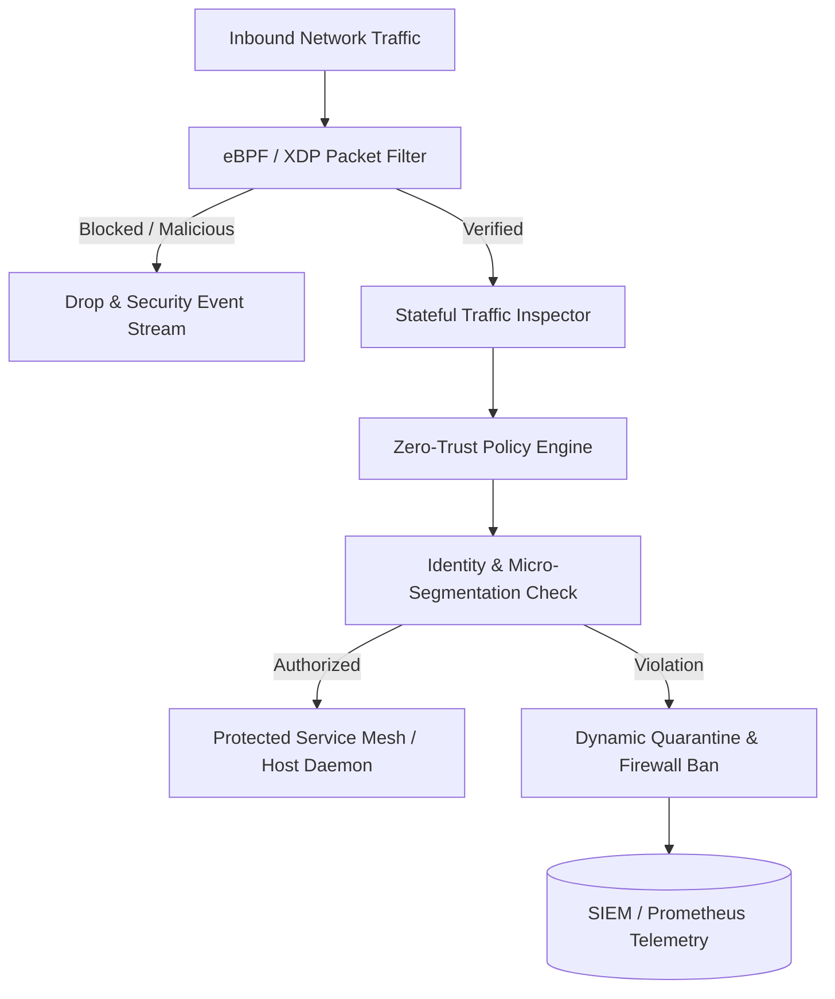

# 🛡️ Enterprise Network Defense & System Hardening Suite
> **Next-generation zero-trust network policy engine, eBPF packet inspection, and automated system hardening orchestration.**

[](https://opensource.org/licenses/MIT)
[](https://www.typescriptlang.org/)
[](https://www.cisecurity.org/)
[]()

---

## 🏛️ System Architecture

The **Enterprise Network Defense Suite** enforces Zero-Trust Network Architecture (ZTNA), automated kernel-level firewall orchestration via eBPF / nftables, real-time IDS/IPS threat signatures, and OS-level hardening based on CIS Benchmarks.



---

## 🚀 Core Capabilities

* **Kernel-Level Packet Inspection (eBPF/XDP):** High-throughput microsecond packet evaluation and DDoS mitigation before network stack processing.
* **Declarative Zero-Trust Policies:** Micro-segmentation rules defined in YAML/JSON enforced across distributed containers and bare-metal nodes.
* **Automated Host Hardening:** One-click compliance audits and continuous drift detection for Linux (Ubuntu, Debian, RHEL) based on CIS Level 1 & 2.
* **Dynamic Intrusion Prevention:** Automated port scan detection, rate-limiting, and distributed IP reputation scoring.
* **Telemetry & Observability:** Native Prometheus metrics, OpenTelemetry traces, and structured JSON audit events.

---

## 📦 Quick Start

### Installation
```bash
npm install @harinish/network-system-security
# or
pnpm add @harinish/network-system-security
```

### Basic Firewall Rule & Policy Enforcement
```typescript
import { NetworkDefenseEngine, ZeroTrustPolicyManager } from '@harinish/network-system-security';

const policyManager = new ZeroTrustPolicyManager();

// Register micro-segmentation rule
policyManager.registerRule({
  id: 'deny-unauthorized-db-access',
  sourceSubnet: '10.0.1.0/24',
  destinationPort: 5432,
  protocol: 'TCP',
  action: 'ALLOW',
  requiredTags: ['role=payments-backend']
});

const engine = new NetworkDefenseEngine({ policyManager });
const evaluation = engine.evaluatePacket({
  sourceIP: '10.0.1.45',
  destinationPort: 5432,
  protocol: 'TCP',
  sourceTags: ['role=payments-backend']
});

console.log('Packet Verdict:', evaluation.verdict); // ALLOW
```

---

## 🤖 Vibe Coding & Autonomous AI Development
This repository is engineered for autonomous AI development:
* [`PRD.md`](./PRD.md) — Comprehensive product requirements and architecture.
* [`ROADMAP.md`](./ROADMAP.md) — Phased milestones.
* [`TODO.md`](./TODO.md) — Atomic implementation checklist with unit test acceptance criteria.
* [`AGENTS.md`](./AGENTS.md) — Architectural invariants and rules for AI agents.

---

## 📄 License
This project is licensed under the **MIT License** - see the [LICENSE](LICENSE) file for details.
